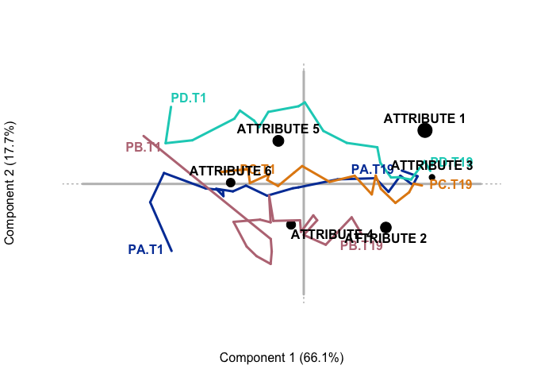
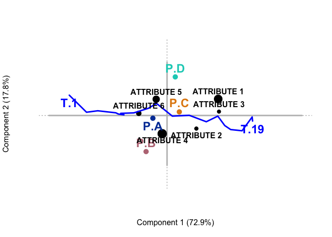
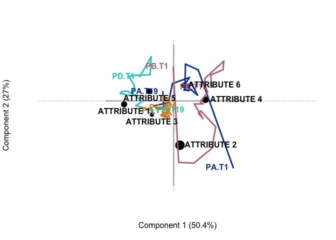

TCATA Examples
================

Introduction
============

Temporal Check-All-That-Apply (TCATA) extends classical Check-All-That-Apply (CATA) by adding a temporal dimension to the evaluation. Because TCATA extends CATA, an obvious visualization of product-attribute associations over time is to treat product x time combinations as individual observations and then use classical Correspondence Analysis (CA) to visualize the associations. Often the CA results and visualization emphasize the chronological features. However, this approach could lead to misinterpretations as time is not just a feature but also a confound. Because of time, all products might show convergence to, e.g., off flavor, which is produced only by a few observations that provide a relative but not an absolute peak in this attribute.

Therefore, we suggest alternative CA approaches to analyze TCATA data that emphasize (Canonical CA, CanCA) or remove (Escofier’s Conditional CA, ConCA) temporal effects. Generally, CanCA was designed to analyze CA data in the presence of row and column covariates; it is related to canonical correlation analysis. When there is only one set of covariates (e.g., row), CanCA is more akin to redundancy analysis. Here, we use external row information – time and product – to emphasize the overall temporal profile applying to all products. CanCA nicely displays the main product differences within the attribute space. CanCA better emphasizes than CA the unique properties of each product over time. Escofier’s conditional CA (ConCA) removes confounding effects such as time. ConCA provides two features for TCATA: (1) effects adjusted for time and (2) more appropriate measures of strength of association that can be used with CA for better visualization.

Below we provide code chunks and output to highlight the three techniques and their properties. Code and simulated data are available [here](./DataCode/).

    ## Loading required package: prettyGraphs

CA
--

The solid lines show the responses to the products (A, B, C, D) over time. With standard CA, we can see a clear effect of time. All early time points are on the left, while all late time points are on the right. This gives the appearance that all the products share common attributes, however, this is a confound of the temporal aspect of TCATA.

CanCA
-----

The temporal aspect of TCATA can be more clearly seen with CanCA, which emphasizes particular *a priori* factors, such as time and products. The attribute structure from CanCA is virutally identical to that as in standard CA. However, when modeled explicitly, we can better see the effects of time, and the products. CanCA helps highlight that the structure of the attributes are likely confounded with time, and do not necessarily reflect the product-attribute associations we would interpret from this graph. This is further supported by the effective orthogonal relationship between time (axis 1; horizontal) and products (axis 2; vertical).

ConCA
-----

When the effects of time are removed we see a very different structure for the attributes, as we do here via ConCA. With time removed, we can more clearly seen the actual relationships between products and attributes, as opposed to how present attributes were over time (as with CA and CanCA).
